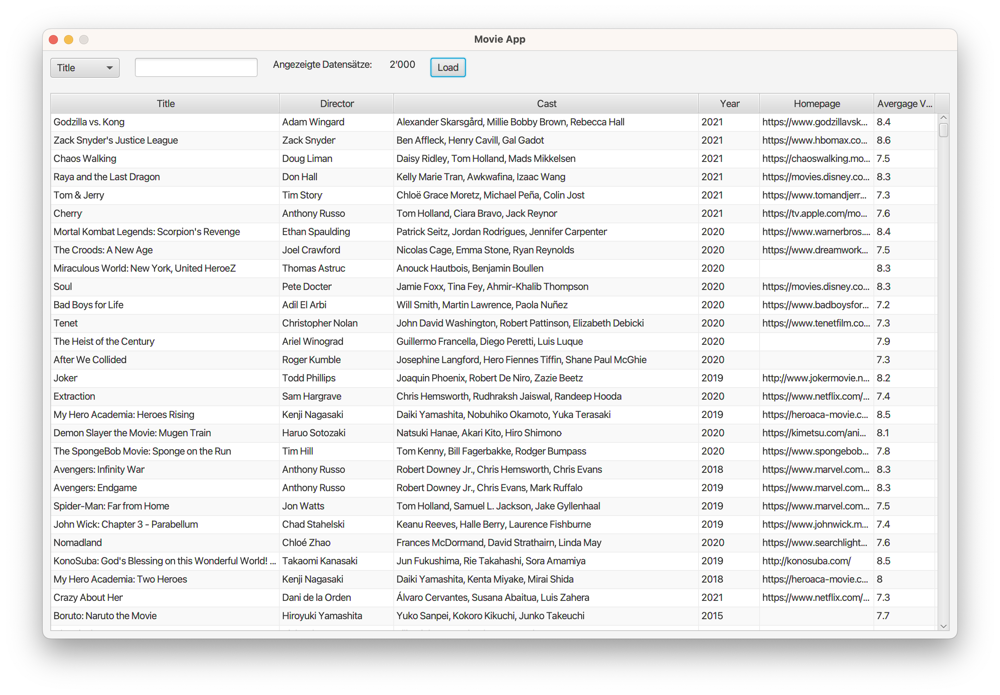

# OOP2 EN3 FS23

## Thema
In dieser Programmieraufgabe geht es darum eine **Movie-App** für die 2000 besten Filme zu schreiben. Die Filme werden von einem Webserver mit dem HTTP Protokoll als [JSON](https://www.json.org/json-en.html) gelesen. Mit der Movie-App kann man nach bestimmten Kriterien filtern und so die gewünschten Daten sichten.


<p>Abbildung 1: Movie-App</p>

## Spezifikation der Anwendung (Funktionale Anforderungen)
Dieses [Video](https://tube.switch.ch/videos/1sTFcQPBar) erklärt die Funktionalität der Anwendung.

## Rahmenbedingungen
Folgende Rahmenbedingungen müssen eingehalten werden:
  - (R1) Diese Prüfung ist eine **Einzelarbeit**. Gemäss Prüfungsordnung resultiert ein Verstoss gegen diese Bedingung oder gegen die Redlichkeitserklärung mit der **Note 1**.
  - (R2) **Die Autor:In bleibt anonym.** Es stehen also keine Namen, Email-Adressen, Hinweise etc. in den abgegebenen Artefakten. Entfernen Sie z.B. alle Dateien die **IntelliJ** als Hidden-Folders erstellt, oder allfällige **Git-Dateien**.
  - (R3) Die Anwendung muss sich in **VS Code öffnen** und ausführen lassen. Bitte testen Sie das - auch wenn Sie mit IntelliJ entwickelt haben.
  - (R4) Setzen Sie das GUI mit JavaFX programmatisch um und verwenden Sie **kein XML** und **kein CSS**.
  - (R5) Folgen Sie dem **Application Template** aus dem Unterricht.
  - (R6) Verwenden Sie für die Umsetzung das **Presentation Model (PM)** Architekturmuster.
  - (R7) Der Code soll mit dem `Liberica Full JDK 17.x` kompiliert und ausgeführt werden können.
  - (R8) Verwenden Sie das mitgelieferte `build.gradle`. Als externe Bibliothek (nicht im JDK oder JavaFX drin), ist nur die im `build.gradle` aufgeführte Bibliothek `org.json` erlaubt.
  - (R9) Verwenden Sie für die Tabelle die [JavaFX Tableview](https://openjfx.io/javadoc/13/javafx.controls/javafx/scene/control/TableView.html).

## Nicht Funktionale Anforderungen (NFA)
- (N1) Keine Klasse hat mehr als 150 Zeilen (inklusive Package-Statement, Import-Statements, Klassenheader und allfälliger Kommentar). Kommentar ist optional.
- (N2) Methoden umfassen maximal 20 Zeilen. Die Methodensignatur ist dabei die erste Zeile. Die letzte Zeile ist die schliessende geschweifte Klammer des Methoden-Körpers.
- (N3) Jede Klasse hat einen JavaDoc Klassenheader (Achtung: Autor weglassen, siehe R2).
- (N4) Es gibt keinen auskommentierten Code. Es gibt keine nicht verwendete Imports.
- (N5) Die Klassen sind über mindestens **drei** Packages organisiert.
- (N6) Logik PM: Die Klasse, welche die Netzwerkkommunikation zum Webserver realisiert wird nur vom PM gebraucht.
- (N7) Daten PM: Die Daten werden ausschliesslich vom PM verwaltet.
- (N8) Die URL des Webservices wird aus einem File gelesen und mittels `java.util.Properties` geladen und gelesen (siehe PL, Collections).
- (N9) Die Anwendung ist konform zu den Regeln von _SonarLint_ (Plugin für [IntelliJ](https://plugins.jetbrains.com/plugin/7973-sonarlint), Plugin für [VS Code](https://marketplace.visualstudio.com/items?itemName=SonarSource.sonarlint-vscode))

## Aufgaben

### 1. UI implementieren
Die **Movie-App** soll sich so verhalten, wie im Video gezeigt. Visuell soll sie sich an die Musterlösung anlehnen. Die Raumaufteilung muss also in etwa der Musterlösung entsprechen. Sie können aber z.B. Farben, Fonts, etc. frei wählen. 

Eine mögliche Vorgehensweise zum Lösen der 1. Aufgabe ist nachfolgend skizziert. Sie können beliebig von diesem Vorschlag abweichen:

1. Setzen Sie das Application Template auf.
2. Erstellen Sie die View, mit Controls und dem entsprechenden Layout. Die Movie-App muss nicht resizable sein.
3. Erstellen und integrieren Sie die Presentation Model Klasse und damit auch die notwendigen Properties und fachlichen Methoden.

### 2. Daten laden implementieren
In dieser Programmieraufgabe arbeiten wir mit dem [HttpClient](./book/horstmann-io-weblient.pdf) und mit [JSON-Java](https://www.baeldung.com/java-org-json). Lesen Sie sich in Ruhe in diese beiden Themen ein und erstellen Sie einen einfachen Proof Of Concept. Ziel ist es die Filme vom Webserver zu laden und z.B. alle Titel der Filme auszugeben:

```
Godzilla vs. Kong
Zack Snyder's Justice League
Chaos Walking
Raya and the Last Dragon
Tom & Jerry
Cherry
...
```
Die Filme können mit dem folgenden URL geladen werden: `https://softwarelab.ch/api/public/v2/movies`

### 3. Einbau der geladenen Daten ins UI
Nachdem das Laden der Daten entwickelt ist, kann diese Funktionalität ins UI integriert werden. Wie arbeitet wohl die Klasse, welche die Daten lädt mit dem Presentation Model zusammen?

## Hinweis zum Arbeitsaufwand
Das Lösen dieser Aufgaben entspricht dem Arbeitsaufwand für einen Anlass im Modul OOP2, also in etwa einer Arbeitszeit von **6 Stunden** (siehe auch OOP2 Drehbuch). Das ist eine Schätzung und auch eine Empfehlung. Beginnen Sie frühzeitig mit der Arbeit. Eliminieren Sie allfällige Risiken zuerst.

## Bewertungskriterien
In diesem Projekt sind 65 Punkte erreichbar.

<br/>

### Bewertung Funktionale Kriterien (41 Punkte)
Grundsätzlich gilt: Font und Farben spielen keine Rolle. Die Grössenverhältnisse der Controls zueinander sollen in etwa der Vorgabe entsprechen. Schauen Sie sich unbedingt das [Video](https://tube.switch.ch/videos/1sTFcQPBar) an, bevor Sie mit der Bewertung beginnen.

#### **(F1) UI Start - Raumaufteilung**
Entspricht die [Raumaufteilung](https://tube.switch.ch/videos/1sTFcQPBar#0:17) der Spezifikation?
- (a) Nein (0Pt) 
- (b) Ja (2Pt)

#### **(F2) UI Start - Controls**
Sind alle [Controls](https://tube.switch.ch/videos/1sTFcQPBar#0:47) gemäss Spezifikation vorhanden und korrekt initialisiert?
- (a) Nein (0Pt) 
- (b) Ja (2Pt)

#### **(F3) UI Verhalten - Initiales Laden, Anzeigen der Daten**
Werden die Daten wie spezifiziert in der Tabelle angezeigt, wenn der [Load-Knopf](https://tube.switch.ch/videos/1sTFcQPBar#1:25) gedrückt wird?
- (a) Nein (0Pt) 
- (b) Ja (3Pt)

#### **(F4) UI Verhalten - Initiales Laden, Anzeige Anzahl Datensätze**
Wird nach dem initialen Laden, die [Anzahl der Datensätze](https://tube.switch.ch/videos/1sTFcQPBar#1:56) korrekt angezeigt? Verifizieren Sie das auch im Code.
- (a) Nein (0Pt) 
- (b) Ja (3Pt)

#### **(F5) UI Verhalten - Laden der Daten vom Endpunkt**
Werden die Daten tatsächlich vom entsprechenden [Endpunkt via dem HTTPS Protokoll](https://tube.switch.ch/videos/1sTFcQPBar#2:26) geladen? Verifizieren Sie das im Code.
- (a) Nein (0Pt) 
- (b) Ja (6Pt)

#### **(F6) UI Verhalten - Mehrfaches Laden der Daten**
Enthält die Liste auch beim [mehrfachem drücken](https://tube.switch.ch/videos/1sTFcQPBar#2:56) des Load-Button immer nur die Anzahl der Filme, welche vom Endpunkt geladen wurden? Verifizieren Sie das im Code.
- (a) Nein (0Pt) 
- (b) Ja (3Pt)

#### **(F7) UI Verhalten - Director**
Wird das [Director](https://tube.switch.ch/videos/1sTFcQPBar#3:32) Feld korrekt angezeigt? Es soll nur das erste Element aus der Liste angezeigt werden.
- (a) Nein (0Pt) 
- (b) Ja (1Pt)

#### **(F8) UI Verhalten - Cast, alle, dynamisch**
Werden die [Cast](https://tube.switch.ch/videos/1sTFcQPBar#4:06)-Members korrekt - Komma separiert - angezeigt? Es sollen alle Einträge in der Liste angezeigt werden. Verifizieren Sie das auch im Code. Am Ende des Strings soll es kein Komma haben. 
- (a) Nein (0Pt) 
- (b) Ja (3Pt)

#### **(F9) UI Verhalten - Year**
Wird das [Year](https://tube.switch.ch/videos/1sTFcQPBar#5:00) Feld korrekt angezeigt? Es soll nur das Jahr angezeigt werden. Das Jahr wird aus dem Attribute `release_date` gelesen.
- (a) Nein (0Pt) 
- (b) Ja (2Pt)

#### **(F10) UI Verhalten - Homepage**
Wird das [Homepage](https://tube.switch.ch/videos/1sTFcQPBar#5:19) Feld korrekt angezeigt? Es gibt Datensätze, welche keine Werte enthalten. Wird das korrekt implementiert? Verifizieren Sie das auch im Code.
- (a) Nein (0Pt) 
- (b) Ja (2Pt)

#### **(F11) UI Verhalten - Korrekte Filter Attribute**
Enthält das Dropdown die [korrekten Attribute](https://tube.switch.ch/videos/1sTFcQPBar#5:38)?
- (a) Nein (0Pt) 
- (b) Ja (1Pt)

#### **(F12) UI Verhalten - Filter, korrektes Verhalten**
Wird das Filtern der Filme [abhängig vom gewählten Attribut](https://tube.switch.ch/videos/1sTFcQPBar#5:50) korrekt durchgeführt? Die Texteingabe muss nicht Case Insensitiv sein. Die Anzeige der Anzahl der dargestellten Filme muss hier nicht korrekt sein.
- (a) Nein (0Pt) 
- (b) Ja (6Pt)

#### **(F13) UI Verhalten - Filter, Anzeige der Anzahl dargestellten Filme**
Zeigt das Label [Angezeigte Datensätze](https://tube.switch.ch/videos/1sTFcQPBar#7:17) beim Filtern die korrekte Anzahl an?
- (a) Nein (0Pt) 
- (b) Ja (2Pt)

#### **(F14) UI Verhalten - Filter, Case Insensitiv**
Funktioniert das Filtern [Case Insensitiv](https://tube.switch.ch/videos/1sTFcQPBar#7:47)?
- (a) Nein (0Pt) 
- (b) Ja (2Pt)

#### **(F15) UI Verhalten - Filter, Reset bei Wechsel des Attributes**
Wird die Anwendung bei einem Wechsel des Filter-Attributes [korrekt zurückgestellt](https://tube.switch.ch/videos/1sTFcQPBar#8:27) (Tabelle, Angezeigte Datensätze, Filter-Text-Input-Field)?
- (a) Nein (0Pt) 
- (b) Ja (3Pt)

<br/><br/>

### Bewertung Rahmenbedingungen (4 Punkte)
Bemerkung zu _(R2) AutorIn ist anonym_: Stellen Sie fest, dass _(R2)_ verletzt ist, korrigieren Sie trotzdem weiter, melden Sie aber das Projekt bei mir.

Es werden nur die Rahmenbedingungen **R5** und **R6** als Kriterien bewertet. Diese Rahmenbedingungen müssen im Code verifiziert werden. 

#### **(R5) Rahmenbedingung - Application Template**
Wird das **Application Template** wird korrekt verwendet (Referenz AB, UB)?
- (a) Nein (0Pt) 
- (b) Ja (2Pt)

#### **(R6) Rahmenbedingung - Presentation Model**
Wird das **Presentation Model (PM)** Architekturmuster wird korrekt verwendet (Referenz AB, UB)?
- (a) Nein (0Pt) 
- (b) Ja (2Pt)

<br/><br/>

### Bewertung Nicht-funktionale Kriterien (20 Punkte)

#### **(N1) NFA - Klassengrösse**
Kommt keine Klasse mit mehr als 200 Zeilen (inklusive Package-Statement, Import-Statements und Kommentare) vor?
- (a) Nein (0Pt) 
- (b) Ja (2Pt)

#### **(N2) NFA - Methodengrösse**
Im Projekt gibt es keine Methoden mit mehr als maximal 20 Zeilen? Die Methodensignatur ist dabei die erste Zeile. Die letzte Zeile ist die schliessende geschweifte Klammer des Methoden-Körpers.
- (a) Nein (0Pt) 
- (b) Ja (2Pt)

#### **(N3) NFA - Existenz Klassenheader**
Hat jede Klasse einen Klassenheader?
- (a) Nein (0Pt) 
- (b) Ja (1Pt)

#### **(N4) NFA - Kein toter Code**
Kommen kein auskommentierter Code und keine nicht verwendeten Imports vor?
- (a) Nein (0Pt) 
- (b) Ja (2Pt)

#### **(N5) NFA - Packages**
Sind die Klassen über mindestens **drei** Packages organisiert?
- (a) Nein (0Pt) 
- (b) Ja (2Pt)

#### **(N6) NFA - Logik PM, Netzwerkkommunikation**
Logik PM: Wird die Klasse, welche die Netzwerkkommunikation zum Webserver realisiert, nur vom PM gebraucht?
- (a) Nein (0Pt) 
- (b) Ja (2Pt)

#### **(N7) NFA - Daten PM, Verwaltung**
Daten PM: Werden die Daten der Anwendung ausschliesslich vom PM verwaltet? Mit Daten sind alle veränderlichen Daten der Anwendung gemeint (Filme, FilterStrings, usw.) gemeint. Der Titel der Anwendung und Labels, welche sich nicht verändern, können, müssen aber nicht im PM verwaltet werden.
- (a) Nein (0Pt) 
- (b) Ja (2Pt)

#### **(N8) NFA - URL wird aus einem File gelesen**
Wird der [URL des Webservices](https://tube.switch.ch/videos/1sTFcQPBar#9:10) mittels `java.util.Properties` (siehe PL, Collections) aus einem File gelesen?
- (a) Nein (0Pt) 
- (b) Ja (3Pt)

#### **(N9) NFA - SonarLint Regeln**
Ist die Anwendung konform zu [den Regeln](https://tube.switch.ch/videos/1sTFcQPBar#10:19) von _SonarLint_?
- (a) Nein (0Pt) 
- (b) Ja (4Pt)

<br/><br/>

## Abgabe der Arbeit
Abgabetermin: **Mittwoch, 07.06.2023 23.59**.

Zur Abgabe müssen Sie eine anonyme Version Ihrer Lösung in der [Peergrading Webapplikation](https://www.cs.technik.fhnw.ch/peergrading/) hochladen. 
Sie können so oft hochladen wie Sie möchten. Die letzte Abgabe vor der Deadline wird dann bewertet.

Gehen Sie dazu wie folgt vor:
1. Erstellen Sie eine Kopie des Ordners, der Ihre Lösung enthält.
2. Nennen Sie diesen Ordner `EN3_Movie`
3. Löschen Sie darin alle Dateien, die Ihre Identität preisgeben könnten. 
   Beispiele:
   - `.git` Ordner
   - IDE Metadaten wie `.project` und `*.iml`
4. Dann komprimieren Sie diesen Ordern mit ZIP:
   - WIN: Rechtsklick "Send To" > compressed (zipped) folder
   - OSX: Rechtsklick "compress" "EN3_Movie"
5. Dieses Archiv laden Sie dann hoch.